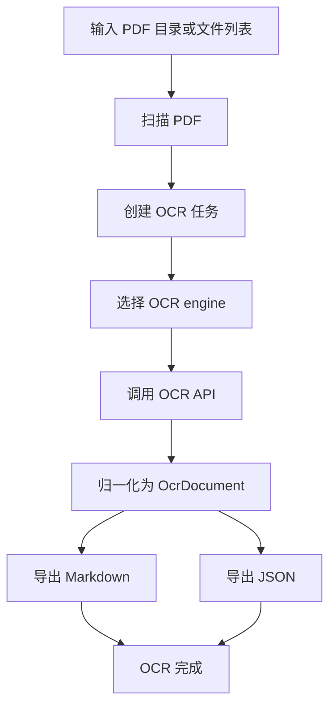
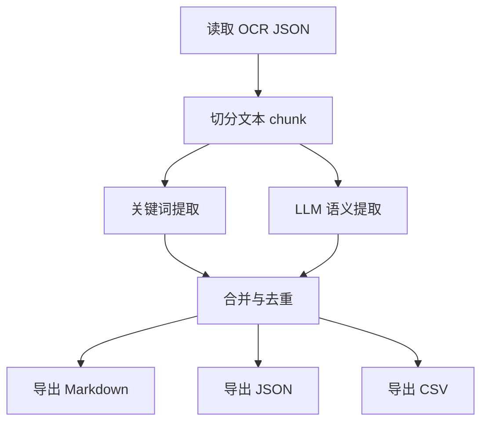

# PDF OCR 与政策文本提取系统技术方案（初稿）

## 1. 技术目标

本阶段先实现一个命令行 MVP，用于验证完整链路：

1. 批量读取本地 PDF。
2. 通过可替换 OCR client 调用 PaddleOCR 或 MinerU API。
3. 将 OCR 结果统一转换为按页组织的数据结构。
4. 导出 Markdown 与 JSON，确保文本可追溯到原始 PDF 页码。
5. 基于 OCR 结果执行关键词提取。
6. 基于 LLM API 执行语义主题提取。
7. 导出带文件名、页码和原文的提取结果。

## 2. 技术选型

### 2.1 语言与运行方式

- 语言：Python 3.11+
- 初期形态：命令行工具
- 配置方式：YAML 配置文件 + 环境变量
- 数据落盘：本地文件系统
- 后续可扩展：Web UI、任务队列、数据库

### 2.2 OCR 接入策略

OCR 服务通过抽象接口接入，不在业务流程中写死具体供应商。

初期预留：

- PaddleOCR API client（预留）
- MinerU API client（已按 v4 API 接入）

由于不同 API 的请求和返回格式可能不同，系统内部统一使用 `OcrDocument` 数据结构。

### 2.3 LLM 接入策略

LLM 默认支持 OpenAI-compatible Chat Completions API。

需要可配置：

- API base URL
- API key
- model
- temperature
- max tokens
- timeout
- retry

这样可以兼容 DeepSeek、OpenAI、硅基流动、火山方舟、OpenRouter 或本地兼容服务。

## 3. 项目结构

```text
Ocean/
  README.md
  pyproject.toml
  config.example.yaml
  .env.example
  docs/
    requirements.md
    technical-design.md
  src/
    ocean/
      __init__.py
      cli.py
      config.py
      models.py
      pdf_loader.py
      pipeline.py
      ocr/
        __init__.py
        base.py
        paddle.py
        mineru.py
      llm/
        __init__.py
        client.py
      extractors/
        __init__.py
        chunker.py
        keywords.py
        semantic.py
      exporters/
        __init__.py
        markdown.py
        jsonl.py
        csv_exporter.py
```

## 4. 核心数据结构

### 4.1 OCR 文档

系统内部统一使用以下结构表示 OCR 结果：

```json
{
  "source_file": "example.pdf",
  "source_path": "/path/to/example.pdf",
  "ocr_engine": "paddleocr",
  "pages": [
    {
      "page_number": 1,
      "text": "本页完整文本",
      "blocks": [
        {
          "block_id": "p1_b1",
          "text": "段落或文本块",
          "page_number": 1,
          "confidence": 0.98
        }
      ]
    }
  ]
}
```

### 4.2 文本块

LLM 分析时使用 chunk：

```json
{
  "chunk_id": "example_p1_p3",
  "source_file": "example.pdf",
  "page_start": 1,
  "page_end": 3,
  "text": "合并后的文本"
}
```

### 4.3 提取结果

关键词和 LLM 的结果统一表示为：

```json
{
  "result_id": "R0001",
  "source_file": "example.pdf",
  "page_start": 12,
  "page_end": 13,
  "extraction_method": "llm",
  "matched_keywords": [],
  "topic": "党的青年工作政策",
  "relevance": "high",
  "reason": "该段涉及青年组织建设。",
  "text": "原文内容"
}
```

## 5. 处理流程

### 5.1 OCR 流程



### 5.2 提取流程



## 6. 命令行设计

### 6.1 OCR

```bash
ocean ocr --input ./pdfs --output ./outputs --config ./config.yaml
```

功能：

- 扫描输入目录下的 PDF。
- 使用配置中的 OCR engine。
- 输出 OCR Markdown 与 JSON。

### 6.2 关键词提取

```bash
ocean extract-keywords --ocr-dir ./outputs/ocr --output ./outputs/extract --config ./config.yaml
```

功能：

- 读取 OCR JSON。
- 根据配置关键词提取段落。
- 输出 Markdown、JSON、CSV。

### 6.3 LLM 语义提取

```bash
ocean extract-semantic --ocr-dir ./outputs/ocr --output ./outputs/extract --config ./config.yaml
```

功能：

- 读取 OCR JSON。
- 按页或 token 切分文本。
- 调用 LLM 判断主题相关内容。
- 输出带来源页码的结果。

## 7. 配置设计

配置分为三部分：

- `ocr`：OCR 引擎和参数。
- `extraction`：关键词、主题、上下文长度。
- `llm`：LLM API 连接参数。

敏感信息优先通过环境变量传入，不提交真实 key。

## 8. 当前实现边界

第一版只搭建可运行骨架：

- OCR client 接口已经定义。
- MinerU client 已实现 v4 API 的上传、轮询、下载和结果归一化。
- PaddleOCR client 暂时预留 API 调用位置。
- LLM client 按 OpenAI-compatible Chat Completions 实现。
- 关键词提取可以直接基于 OCR JSON 运行。
- Markdown/JSON/CSV 导出可用。

## 9. 后续扩展方向

1. 使用真实 MinerU token 进行样本测试。
2. 接入真实 PaddleOCR API。
3. 增加 OCR 质量对比脚本。
4. 增加简繁转换。
5. 增加 PDF 页面截图和 OCR 文本对照校验。
6. 增加 Web UI。
7. 增加任务数据库和断点续跑。
8. 增加人工审核与标注界面。
